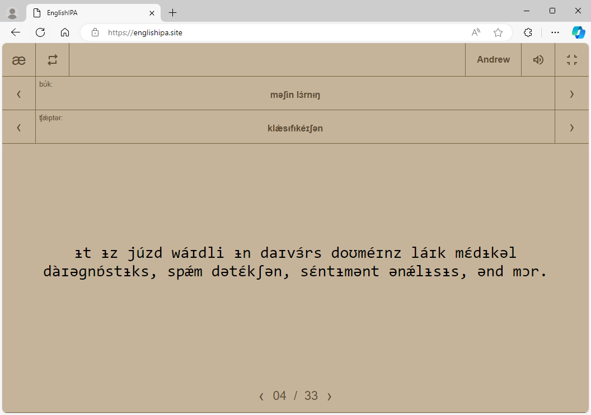

# Welcome to EnglishIPA
visit us at [englishipa.site](https://englishipa.site/)

EnglishIPA is a collection of books (written by AI, like Claude Sonnet 3.5) that span a wide range of topics, from psychology to machine learning and more.

Options:
1. Spelling mode.
    [a] For Standard English Spelling.
    [æ] For American English Phonetic.
2. Playing mode:
    [o] Loop:
    [>] Forward:
3. Sound: 
    [↺] Sound activated
    [→] Silence
4. Reader:
    [] Choose your favorite reader
5. Display:
    [] Full-screen mode activated
    [] Full-Screen mode deactived